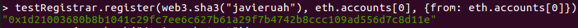
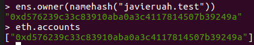
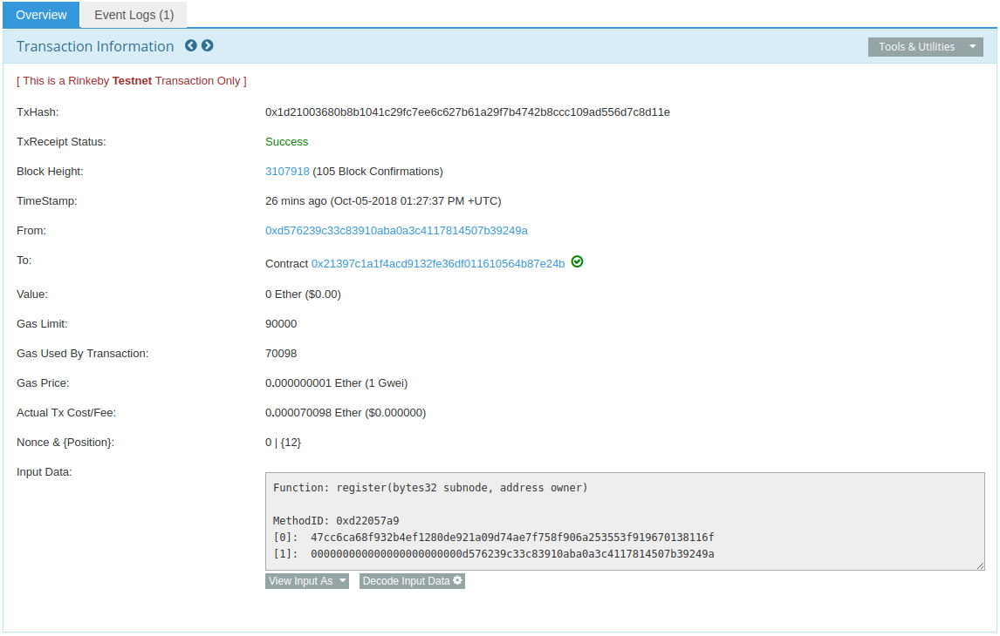

## solidity-uah-modulo3

### **Actividad 1** - ENS

En primer lugar, sincronizamos la red Rinkeby con el comando `geth --rinkeby`.

A continuación, se descarga el archivo ABI del contrato para dar de alta dominios `.test`: [ensutils-rinkeby.js](ensutils-rinkeby.jsl)

Se accede al nodo Ethereum con `geth attach http://127.0.0.1:8545` y se ejecuta el script:

La ejecución del script es correcta ya que nos devuelve el booleano `true`.

Ahora, se intenta comprobar si el dominio que queremos registrar existe o no: `testRegistrar.expiryTimes(web3.sha3("javieruah"))`

El resultado de esta operación nos devuelve un error de dirección invalida.

Despues de analizar y buscar información en Internet (GitHub de ENS entre otros), sabemos que el problema reside en que no tenemos sincronizado la red Rinkeby al 100%. Se ha intentado modificar la configuración de la maquina virtual por un disco duro solido (SSD), pero tampoco se ha sido capaz de sincronizar al completo.

Tras varios intentos, se descubrió que el comando de `geth` admite un parámetro que es el `--syncmode` que admite tres posibles valores: "full", "fast" y "light". Con este último, que solo obtiene el estado actual, se ha logrado la sincronización con la red, pudiendo así resolver el ejercicio.

Ahora, se comprueba si el dominio que se quiere registrar está disponible:
`testRegistrar.expiryTimes(web3.sha3("javieruah"))`

Para registrarlo, ha sido necesario desbloquear la cuenta con `personal.unlock(...)`

Ya se puede registrar el dominio y comprobar cual es el propietario del mismo. Para ello, ha sido necesario disponer de balance en la cuenta:
`testRegistrar.register(web3.sha3("javieruah"), eth.accounts[0], {from: eth.accounts[0]})`

Dominio javieruah.test: `0x1d21003680b8b1041c29fc7ee6c627b61a29f7b4742b8ccc109ad556d7c8d11e`

Como se ve en la siguiente captura, la direccion del propietario coincide con la cuenta con que se ha comprado.

A continuación, se indica la dirección del Resolver utilizado para registrar el dominio: `0xe7410170f87102df0055eb195163a03b7f2bff4a`

Por último, se adjunta una captura de la transacción analizada desde Etherscan:
[Ver aquí](https://rinkeby.etherscan.io/tx/0x1d21003680b8b1041c29fc7ee6c627b61a29f7b4742b8ccc109ad556d7c8d11e)

### Autor
- Javier Gasso
