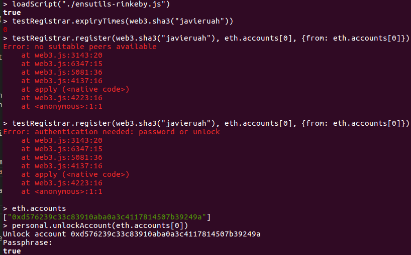

## solidity-uah-modulo3

### **Actividad 1** - ENS

En primer lugar, sincronizamos la red Rinkeby con el comando `geth --rinkeby`.

A continuación, se descarga el archivo ABI del contrato para dar de alta dominios `.test`: [ensutils-rinkeby.js](ensutils-rinkeby.jsl)

Se accede al nodo Ethereum con `geth attach http://127.0.0.1:8545` y se ejecuta el script:

La ejecución del script es correcta ya que nos devuelve el booleano `true`.

Ahora, se intenta comprobar si el dominio que queremos registrar existe o no: `testRegistrar.expiryTimes(web3.sha3("javieruah"))`

El resultado de esta operación nos devuelve un error de dirección invalida.

Despues de analizar y buscar información del problema en Internet (GitHub de ENS entre otros), sabemos que el problema resida en que no tenemos sincronizado la red Rinkeby al 100%. Se ha intentado modificar la configuración de la maquina virtual por un disco duro solido (SSD), pero tampoco se ha sido capaz de sincronizar al completo.

Si tuviesemos el nodo completamente sincronizado, el dominio se registraría con el siguiente comando: `testRegistrar.register(web3.sha3("javieruah"), eth.accounts[0], {from: eth.accounts[0]})`.

Esto retornaría la dirección y para ver el owner del dominio sería así: `ens.owner(namehash("javieruah.test"))`

Por otra parte, se ha buscado otra solución, montando una red con `testrpc` en local:

Además, se ha clonado el siguiente repositorio que contiene contratos para registrar dominios `.ens`:

[https://github.com/ensdomains/ens](https://github.com/ensdomains/ens)

Se ha compilado y migrado el proyecto truffle dentro de la red pero no se ha sido capaz de registrar un dominio `.test`

### Autor
- Javier Gasso
