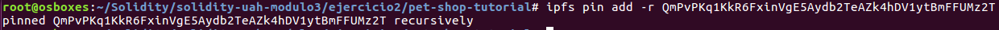

## solidity-uah-modulo3

### **Actividad 2** - IPFS

Se sincroniza la red rinkeby con el cliente Geth:
`geth --rinkeby --syncmode "light" --rpc --rpcapi db,eth,net,web3,personal --cache=1024 --rpcport 8545 --rpcaddr 127.0.0.1 console`

Se desbloquea la cuenta desde la que vamos a desplegar el contrato:
`personal.unlockAccount(eth.accounts[0])`

A continuación, se modifica el fichero [truffle.js](pet-shop-tutorial/truffle.js) de configuración para añadir los datos de la red de Rinkeby donde se va a desplegar.

Se migra el contrato con el comando `truffle migrate --network rinkeby`

En el siguiente enlace se muestra el contrato Adoption desplegado en Rinkeby:
- https://rinkeby.etherscan.io/address/0x8fb9fa1a64c38e12190934d89c8e7f268792bc02

A continuación, se levanta la daemon de IPFS:

Se suben los recursos necesarios a IPFS de forma recursiva del proyecto que contiene los ficheros web y la información de los contratos desplegados en Rinkeby:

Se hace un pin recursivo para que los recursos se mantengan (aunque no es garantizado) más tiempo:

Por último, en el siguiente enlace se accede a los recursos subidos a IPFS:
- https://gateway.ipfs.io/ipfs/QmPvPKq1KkR6FxinVgE5Aydb2TeAZk4hDV1ytBmFFUMz2T/

Dirección Rinkeby utilizada para adoptar: `0x524c96433f2809727535040674039b84fA8B9A44`

### Autor
- Javier Gasso
