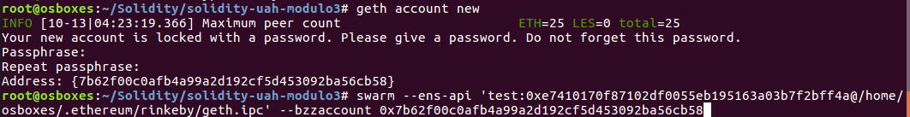
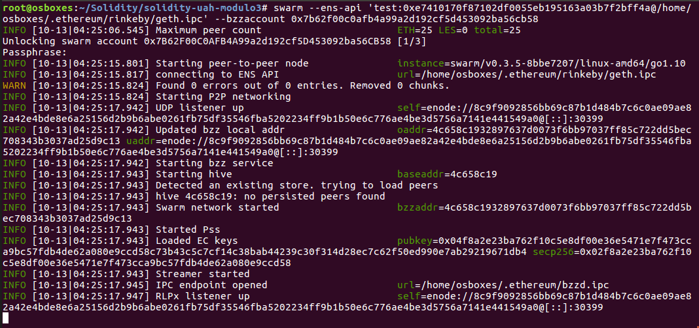
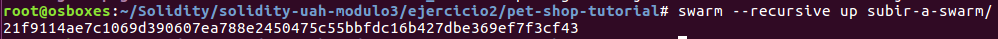
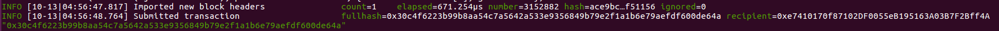
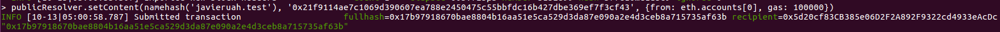
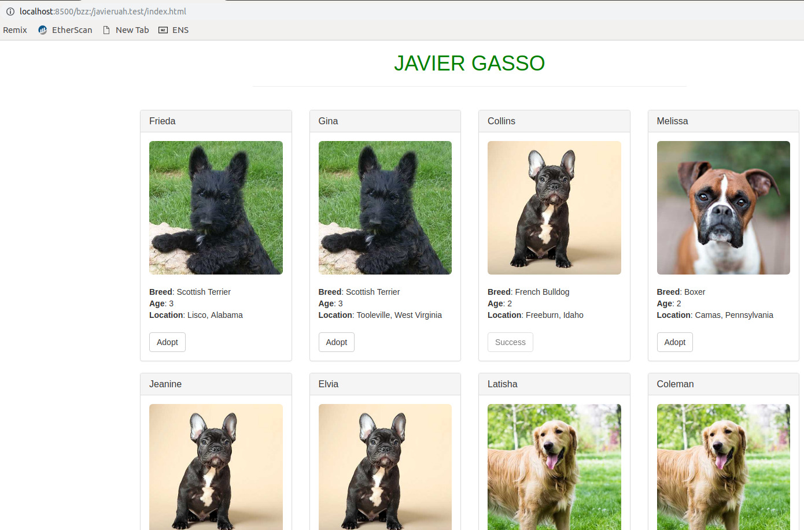

## solidity-uah-modulo3

### **Actividad 3** - SWARM

En primer lugar se conecta con la red de Rinkeby a través del siguiente comando:

`geth --rinkeby --syncmode "light" --rpc --rpcapi db,eth,net,web3,personal,shh --maxpeers 30 --cache 1024 --shh --rpcport 8545 --rpcaddr 127.0.0.1 --rpccorsdomain "*" --port 30303 console`

A contiuación, se crea una nueva cuenta tal como se muestra en la imagen:

Ya es posible utilizar el comando `swarm` con la cuenta creada especificando la ENS de Rinkeby:

`swarm --ens-api 'test:0xe7410170f87102df0055eb195163a03b7f2bff4a@/home/osboxes/.ethereum/rinkeby/geth.ipc' --bzzaccount 0x7b62f00c0afb4a99a2d192cf5d453092ba56cb58`

Ahora, se suben los recursos web de la DApp a Swarm de forma recursiva:

Una vez se suben, swarm devuelve el hash de contenido, que es: `21f9114ae7c1069d390607ea788e2450475c55bbfdc16b427dbe369ef7f3cf43`

Si se accede a la URL `http://localhost:8500` y se pone el Swarm Hash la DApp queda disponible.

Por último, se va asociar el dominio adquirido en ejercicios anteriores para que apunte a dicho Hash:

La URL final de la DApp es: `http://localhost:8500/bzz:/javieruah.test/index.html`

### Autor
- Javier Gasso